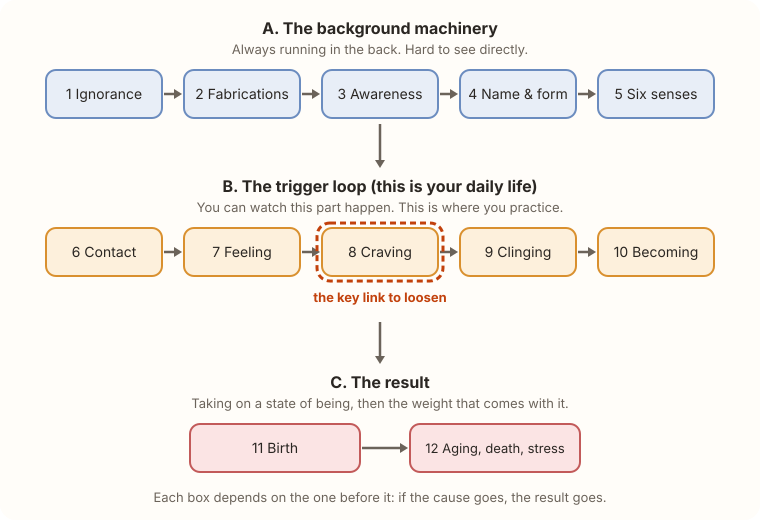
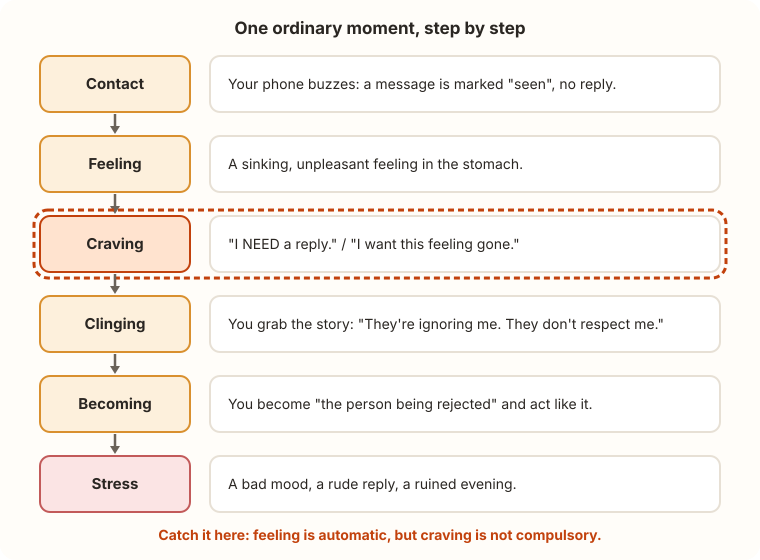

# Lesson 5: Dependent Origination (Dependent Co-arising)

**Time: 12 minutes** · Sources: [SN 12.2](https://www.dhammatalks.org/suttas/SN/SN12_2.html) (the twelve links defined), [MN 38](https://www.dhammatalks.org/suttas/MN/MN38.html) (the chain applied to a student's mistaken view), [SN 12.23](https://www.dhammatalks.org/suttas/SN/SN12_23.html) (each link as the "support" for the next)

## Two-minute version

**Dependent origination** (also called *dependent co-arising*, *paṭicca samuppāda*) answers one question: **"How does stress get made, step by step?"**

The answer is a **chain**. Each link **depends on** the one before it.

The Buddha's short formula: **"When this is, that is. When this isn't, that isn't."**

- It's not a list of *things*. It's a list of **steps in a process**.
- If you remove a cause, the result stops. That's why there's a way out.
- You don't need all twelve to start. **Focus on group B**, the loop you can actually watch.

## Step by step

### Step 1: Think "recipe", not "list"
Like a recipe: no flour, no bread. No craving, no clinging. Each step needs the one before it. **Take away an ingredient and the dish doesn't happen.**

Ṭhānissaro Bhikkhu's book [*The Shape of Suffering*](https://www.dhammatalks.org/books/ShapeOfSuffering/) explains the whole chain through **feeding**: each step is fed by the one before it, and in turn feeds the next. Stop the feeding and the chain starves.

### Step 2: Group A, the background machinery (links 1-5)
Skim this part. You can't see it directly.

| # | Link | Plain English |
|---|------|---------------|
| 1 | **Ignorance** (*avijjā*) | Not understanding the four noble truths: not seeing where stress comes from |
| 2 | **Fabrications** (*saṅkhāra*) | Mentally shaping experience: intentions, inner talk |
| 3 | **Awareness** (*viññāṇa*) | Being conscious through the senses |
| 4 | **Name & form** (*nāma-rūpa*) | The mental and physical "stuff" of an experience |
| 5 | **Six senses** (*saḷāyatana*) | Eye, ear, nose, tongue, body, mind: your doorways |

**One sentence:** not seeing clearly keeps the mind making things up, and that shapes how you take in the world.

### Step 3: Group B, the trigger loop (links 6-10)
**This is the part to learn well.**

| # | Link | Plain English |
|---|------|---------------|
| 6 | **Contact** (*phassa*) | A sense meets something: a sound, a thought, a text message |
| 7 | **Feeling** (*vedanā*) | Pleasant, painful, or neither (see [Lesson 4](../2-the-cause/04-five-aggregates.md)) |
| 8 | **Craving** (*taṇhā*) | Thirst: for pleasure, for becoming, for non-becoming (see [Lesson 2](../2-the-cause/02-craving.md)) |
| 9 | **Clinging** (*upādāna*) | Grabbing on: to pleasures, views, habits, a sense of self (see [Lesson 3](../2-the-cause/03-clinging.md)) |
| 10 | **Becoming** (*bhava*) | Taking on an identity in a situation ("I'm the one being wronged") |

### Step 4: Group C, the result (links 11-12)

| # | Link | Plain English |
|---|------|---------------|
| 11 | **Birth** (*jāti*) | The state of being you've taken on actually appears |
| 12 | **Aging, death, stress** | The suffering that comes with any taken-on state |

### Step 5: Watch it happen in one ordinary moment

Read it top to bottom. Notice how **fast** it happens. The whole chain can run in a few seconds.

### Step 6: Find the gap
Two links are *automatic*:
- **Contact** happens, because your senses work.
- **Feeling** follows, because a feeling always shows up.

The *next* link, **craving**, is where you have a choice. The feeling doesn't **force** you to crave. That gap, between feeling and craving, is the practice. It's not easy, but it's real.

### Step 7: Both directions
The Buddha also taught the chain **in reverse**: when **ignorance** fades, fabrications fade, and so on down the line, until **stress ends**. That is the *third noble truth* ([Lesson 1](../1-the-problem/01-four-noble-truths.md)) stated as a sequence.

### Step 8: Know this point is debated
Traditional commentaries read the twelve links as spreading **across three lifetimes**. Ṭhānissaro Bhikkhu emphasizes that the chain also runs **moment to moment, right now**, which is why it's useful for practice. This lesson follows his reading. Scholars and teachers differ, so check the sources.

## Try it now (4 minutes)

Run the loop once, on paper or in your head:

1. **Contact:** What just happened? (one line)
2. **Feeling:** Nice, nasty, or neutral?
3. **Craving:** What did I *want*: more, less, or to be someone?
4. **Clinging:** What story or view did I grab?
5. **Becoming:** Who did I turn into?

Then ask: **"What if I'd stopped at step 3?"** You don't have to succeed. Noticing is the practice.

**Short on time?** Just ask, once today, **"Nice, nasty, or neutral, and what do I want?"**

## Check yourself

What does "dependent" mean here?
Each link needs the one before it. Remove the cause and the result doesn't happen.

Which group should a beginner focus on?
Group B, the trigger loop, because you can watch it in daily life.

Which link sits between feeling and clinging?
Craving.

Why is the gap after feeling important?
Feeling is automatic, but craving isn't compulsory. That's the best place to interrupt the chain.

Is dependent origination only about past and future lives?
Traditional commentaries read it that way. Ṭhānissaro Bhikkhu emphasizes that it also runs moment to moment.

## Common mix-ups

- **"It's a timeline of my life."** It's a process that can run in seconds.
- **"Everything causes everything."** It's a specific chain of causes for **stress**, not a theory of everything.
- **"I must understand all twelve to practice."** Start with the loop from contact to becoming.
- **"Feelings are the problem."** Feelings are automatic. The trouble starts when craving and clinging follow.
- **"This means I'm stuck with it."** The whole point is that it can be interrupted.

## Go deeper (optional)

- Ṭhānissaro Bhikkhu, [*The Shape of Suffering*](https://www.dhammatalks.org/books/ShapeOfSuffering/): the full treatment
- [SN 12.2](https://www.dhammatalks.org/suttas/SN/SN12_2.html): the Buddha's own definition of each link
- Previous: [Lesson 4: Five Aggregates](../2-the-cause/04-five-aggregates.md) · Next: [Lesson 6: Three Characteristics](06-three-characteristics.md)
